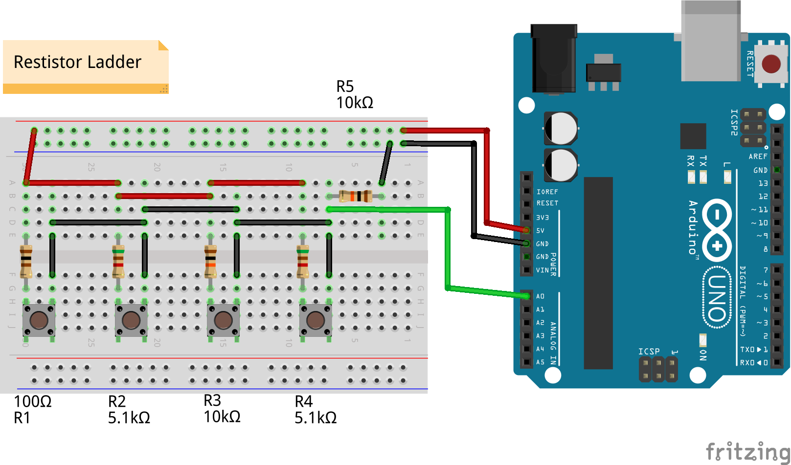

# Arduino Button Ladder

It is an utility class for Switches, 
in this case are Push-Button. 
 With debouce sistem based on time that is configurable  
Very simple to use :    
You have to pass a <em> method(int val) </em> do you prefer to the constructor 
The <em>val</em> parameter give you the value in voltage read by the analog input 

<code>
  ButtonLadder* butt_ladder = new ButtonLadder(PIN_LADDER, exploreVoltRange);
</code>
 

Check the example in the ButtonLadderExample folder

  

